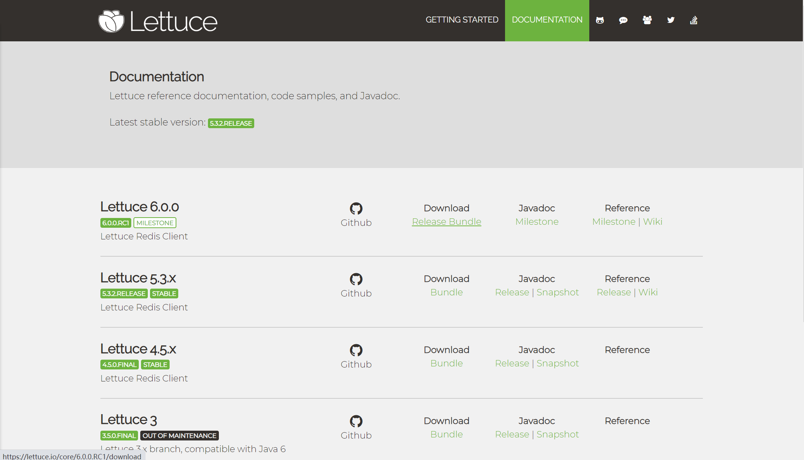

## Lettuce(生菜)学习笔记

#### 简介

> 官网：https://lettuce.io/

```TXT
	Lettuce是一个高性能基于Java编写的Redis驱动框架，底层集成了Project Reactor供天然的反应式编程，通信框架集成了Netty使用了非阻塞IO，5.x版本之后融合了JDK1.8的异步编程特性，在保证高性能的同时提供了十分丰富易用的`API。
	注意一点：Redis的版本至少需要2.6，当然越高越好，API的兼容性比较强大。
```



#### Lettuce和Jedis的比较

```TXT
	Jedis在实现上是直接连接的redis server，如果在多线程环境下是非线程安全的，这个时候只有使用连接池，为每个Jedis实例增加物理连接。Lettuce的连接是基于Netty的，连接实例（StatefulRedisConnection）可以在多个线程间并发访问，因为StatefulRedisConnection是线程安全的，所以一个连接实例（StatefulRedisConnection）就可以满足多线程环境下的并发访问，当然这个也是可伸缩的设计，一个连接实例不够的情况也可以按需增加连接实例。
	Springboot2之前redis的连接池为jedis，2.0以后redis的连接池改为了lettuce，lettuce能够支持redis4，需要java8及以上。lettuce是基于netty实现的与redis进行同步和异步的通信
```

#### Lettuce的使用

> pom.xml文件中导入依赖Jar包

```XML
<!-- https://mvnrepository.com/artifact/io.lettuce/lettuce-core -->
<dependency>
    <groupId>io.lettuce</groupId>
    <artifactId>lettuce-core</artifactId>
    <version>5.3.1.RELEASE</version>
</dependency>
```

#### 主要学习内容

> 1. Lettuce原生基础学习，包括单机，主从，哨兵和集群，本项目主要侧重于单机和主从的·学习和使用。
> 2. Lettuce使用连接池。
> 3. 在SpringBoot中配置和整合Lettuce
> 4. 使用spring-boot-starter-data-redis

#### Lettuce基础学习

#####  Lettuce单机连接：com.zss.lettuce.ConnectTest.class

有三种连接方式：

1. 定制的字符串`URI`语法：

```Java
RedisURI uri = RedisURI.create("redis://localhost/");
```

2. 使用建造器（RedisURI.Builder）；

```Java
RedisURI uri = RedisURI.builder().withHost("localhost").withPort(6379).build();
```

3. 直接通过构造函数实例化：

```Java
RedisURI uri = new RedisURI("localhost", 6379, 60, TimeUnit.SECONDS);
```

连接测试：

```Java
/**
 * 创建连接
 */
private RedisClient getRedis() {
    // 创建连接信息
	RedisURI redisUri = RedisURI.builder()
        .withHost(HOST) 	// 127.0.0.1
        .withPort(PORT)		// 6379
    	.withDatabase(DATABASE) // 0
    	.build();
    // 创建客户端
	return RedisClient.create(redisUri);
}
/**
 * 关闭连接
 */
private void shutDownRedis(RedisClient redisClient) {
	redisClient.shutdown();
}
```

连接测试：

```Java
/**
 * 同步
 */
public void setTest() {
    RedisClient redisClient = getRedis();
    /*RedisCommands<String, String> commands = redisClient.connect().sync();
    String set = commands.set("name", "zss_test");*/
    RedisCommands<String, String> sync = redisClient.connect().sync();
    // 设置Set参数，nx:只在键不存在时，才对键进行设置操作 ex:过期时间
    SetArgs setArgs = SetArgs.Builder.nx().ex(10);
    String set = sync.set("country", "China", setArgs);
    System.out.println("Set Result : [" + set + "]");
    // Set Result : [OK]
	shotDownRedis(redisClient);
}
/**
 * 同步
 */
public void getTest() {
	RedisClient redisClient = getRedis();
    RedisCommands<String, String> sync = redisClient.connect().sync();
    String country = sync.get("country");
    System.out.println("Get Result : [ " + country + " ]");
    // Get Result : [ China ]
    shotDownRedis(redisClient);
}
/**
 * 异步
 */
public void setAsyncTest() {
    RedisClient redis = getRedis();
    RedisAsyncCommands<String, String> async = redis.connect().async();
    RedisFuture<String> setAsync = async.set("name", "zss_async");
    setAsync.thenAccept(value -> System.out.println("Value : " + value));
    redis.shutdown();
	shotDownRedis(redis);
}
/**
 * 同步
 */
public void getAsyncTest() {
	RedisClient redis = getRedis();
    RedisAsyncCommands<String, String> async = redis.connect().async();
    RedisFuture<String> name = async.get("name");
    name.thenAccept(value -> System.out.println("Value : " + value));
    LettuceFutures.awaitAll(1, TimeUnit.MINUTES, name);
    // Value : zss_async
    shotDownRedis(redis);
}
```

#### Lettuce主从连接: com.zss.lettuce.MasterSlaveTest.class

```Java
/**
 * 连接方法一
 */
private StatefulRedisMasterReplicaConnection<String, String> getRedis() {
        // 创建连接信息
        RedisURI redisUri = RedisURI.builder()
                .withHost(HOST)		// 127.0.0.1
                .withPort(PORT)		// 6379
                .withDatabase(DATABASE)		// 0
                .build();

        RedisClient redisClient = RedisClient.create(redisUri);
        RedisCodec<String, String> codec = StringCodec.UTF8;
        StatefulRedisMasterReplicaConnection<String, String> connect =
                MasterReplica.connect(redisClient, codec, redisUri);
        // 只从从节点读取数据
        connect.setReadFrom(ReadFrom.REPLICA);
        return connect;
}
/**
 * 连接方法二
 */
private StatefulRedisMasterReplicaConnection<String, String> getRedisV2() {
        // 创建连接信息
        List<RedisURI> uris = new ArrayList<>();
        uris.add(RedisURI.Builder.redis("127.0.0.1", 6379).build());
        uris.add(RedisURI.Builder.redis("127.0.0.1", 6378).build());
        uris.add(RedisURI.Builder.redis("127.0.0.1", 6377).build());

        RedisClient redisClient = RedisClient.create();
        RedisCodec<String, String> codec = StringCodec.UTF8;
        StatefulRedisMasterReplicaConnection<String, String> connect =
                MasterReplica.connect(redisClient, codec, uris);
        // 只从从节点读取数据
        connect.setReadFrom(ReadFrom.REPLICA);
        return connect;
}
```

连接测试：

```Java
public void setTest() {
	StatefulRedisMasterReplicaConnection<String, String> redis = getRedis();
    RedisCommands<String, String> sync = redis.sync();
    String set = sync.set("master", "slave");
    System.out.println("Set : " + set);
    // Set : OK
    redis.close();
}
public void getTest(){
    StateFulRedisMasterReplicaConnection<String, String> redis = getRedis();
    RedisCommands<String, String> sync = redis.sync();
    String master = sync.get("master");
    System.out.println("Get Result : " + master);
    // Get Result : slave
    redis.close();
}
public void setTestV2() {
	StatefulRedisMasterReplicaConnection<String, String> redisV2 = getRedisV2();
    RedisCommands<String, String> sync = redisV2.sync();
    String set = sync.set("master", "slave");
    System.out.println("Set Result V2 : " + set);
    redisV2.close();
}
public void getTest(){
    StateFulRedisMasterReplicaConnection<String, String> redisV2 = getRedisV2();
    RedisCommands<String, String> sync = redisV2.sync();
    String master = sync.get("master");
    System.out.println("Get Result : " + master);
    redis.close();
}
```

##### Lettuce使用连接池：com.zss.lettuce.RedisPoolTest.class

> pom.xml文件中导入对象池依赖Jar包

```XML
<!-- https://mvnrepository.com/artifact/org.apache.commons/commons-pool2 -->
<dependency>
    <groupId>org.apache.commons</groupId>
    <artifactId>commons-pool2</artifactId>
    <version>2.8.0</version>
</dependency>
```

连接池相关配置

```java
/**
 * 从连接池中获取连接实例
 */
private StatefulRedisConnection<String, String> getRedisConnect() {
    // 创建连接信息
	RedisURI redisUri = RedisURI.builder()
    	.withHost(HOST)		// 127.0.0.1
        .withPort(PORT)		// 6379
        .withDatabase(DATABASE)		// 0
        .withTimeout(Duration.of(10, ChronoUnit.SECONDS))
        .build();
	RedisClient redisClient = RedisClient.create(redisUri);
    GenericObjectPoolConfig<StatefulRedisConnection<String, String>> poolConfig =
    	new GenericObjectPoolConfig<>();
	// 对象池中最大的空闲对象个数。默认值是8。
    poolConfig.setMaxIdle(10);
    // 对象池中最小的空闲对象个数。默认值是0。
    poolConfig.setMinIdle(0);
    // 对象池中管理的最多对象个数。默认值是8。
    poolConfig.setMaxTotal(10);
    // 在获取对象的时候检查有效性, 默认false
    poolConfig.setTestOnBorrow(true);
    // 在归还对象的时候检查有效性, 默认false
    poolConfig.setTestOnReturn(false);
    // 在创建对象时检测对象是否有效，默认值是false。
    poolConfig.setTestOnCreate(true);
    // 当连接池资源耗尽时，等待时间，超出则抛异常，默认为-1即永不超时, ms
    poolConfig.setMaxWaitMillis(10000L);

    GenericObjectPool<StatefulRedisConnection<String, String>> genericObjectPool =
    	ConnectionPoolSupport.createGenericObjectPool(redisClient::connect, poolConfig);
	try {
    	return genericObjectPool.borrowObject();
	} catch (Exception e) {
    	System.out.println("Redis Connection Pool Exception : " + e.getMessage());
        return null;
	}
}
```

连接测试

```Java
public void setFromPoolTest() {
	StatefulRedisConnection<String, String> redisConnect = getRedisConnect();
    if (redisConnect == null) {
    	System.out.println("获取连接失败");
	} else {
    	RedisCommands<String, String> sync = redisConnect.sync();
        SetArgs setArgs = SetArgs.Builder.nx().ex(20);
        String set = sync.set("local", "shanghai", setArgs);
        System.out.println("Set Result : " + set);
        // Set Result : OK
        redisConnect.close();
	}
}
public void getFromPoolTest() {
    StatefulRedisConnection<String, String> redisConnect = getRedisConnect();
    if (redisConnect == null) {
    	System.out.println("获取连接失败");
	} else {
    	RedisCommands<String, String> sync = redisConnect.sync();
        String local = sync.get("local");
        System.out.println("Get Result : " + local);
        // Get Result : shanghai Or null
        redisConnect.close();
	}
}
```

#### 通过以上的几个测试类的编写和测试，下面进行更完整的写法

##### 编写RedisPool类：com.zss.lettuce.config.RedisPool.class

实现步骤：

> 1. 获取配置文件*redis.properties*中的配置信息
> 2. 配置连接池
> 3. 创建RedisClient连接
> 4. 创建连接池
> 5. 从连接池中获取对象
> 6. 将对象还给连接池

下面是具体实现：

```Java
static {
    Properties properties = new Properties();
	InputStream resourceAsStream = RedisPool.class
    	.getClassLoader()
    	.getResourceAsStream("redis.properties");
	try {
		properties.load(resourceAsStream);
    } catch (IOException e) {
	    // todo 通过日志打印异常信息
    	e.printStackTrace();
    }
    HOST = properties.getProperty("redis.host");
	PORT = Integer.valueOf(properties.getProperty("redis.port"));
	 = Integer.valueOf(properties.getProperty("redis.database"));
    TIME_OUT = Long.valueOf(properties.getProperty("redis.time_out"));
	MAX_IDLE = Integer.valueOf(properties.getProperty("redis.max_idle"));
	MIN_IDLE = Integer.valueOf(properties.getProperty("redis.min_idle"));
    MAX_TOTAL = Integer.valueOf(properties.getProperty("redis.max_total"));
    MAX_WAIT_MILLS = Long.valueOf(properties.getProperty("redis.max_wait_mills"));
	TEST_ON_BORROW = Boolean.valueOf(properties.getProperty("redis.test_on_borrow"));
	TEST_ON_CREATE = Boolean.valueOf(properties.getProperty("redis.test_on_create"));
	TEST_ON_RETURN = Boolean.valueOf(properties.getProperty("redis.test_on_return"));
}
/**
 * Redis连接池
 */
private static GenericObjectPool<StatefulRedisConnection<String, String>> genericObjectPool;
/**
 * 连接Redis
 *
 * @return redis连接实例
 */
public static StatefulRedisConnection<String, String> getRedis() {
	// 创建连接信息
    RedisURI redisUri = RedisURI.builder()
    	.withHost(HOST)
        .withPort(PORT)
        .withDatabase(DATABASE)
        .withTimeout(Duration.of(TIME_OUT, ChronoUnit.SECONDS))
        .build();

	// 配置连接池
	GenericObjectPoolConfig<StatefulRedisConnection<String, String>> poolConfig =
    	new GenericObjectPoolConfig<>();
	poolConfig.setMaxIdle(MAX_IDLE);
    poolConfig.setMinIdle(MIN_IDLE);
    poolConfig.setMaxTotal(MAX_TOTAL);
    poolConfig.setTestOnBorrow(TEST_ON_BORROW);
    poolConfig.setTestOnReturn(TEST_ON_RETURN);
    poolConfig.setTestOnCreate(TEST_ON_CREATE);
    poolConfig.setMaxWaitMillis(MAX_WAIT_MILLS);

    // 创建客户端连接
    RedisClient redisClient = RedisClient.create(redisUri);

    genericObjectPool = ConnectionPoolSupport
    	.createGenericObjectPool(redisClient::connect, poolConfig);
	try {
    	return genericObjectPool.borrowObject();
	} catch (Exception e) {
    	// todo 将异常信息通过日志打印
        System.out.println("Redis Connection Pool Exception : " + e.getMessage());
        return null;
	}
}

/**
 * 将连接实例对象归还给对象连接池
 *
 * @param redis 连接实例
 */
public static void returnRedis(StatefulRedisConnection<String, String> redis) {
	genericObjectPool.returnObject(redis);
}

/**
 * 获取连接池信息
 * NumActive : 对象池中有对象对象是活跃的
 * NumIdle : 对象池中有多少对象是空闲的
 */
public static void getPoolMessage() {
    int numActive = genericObjectPool.getNumActive();
	int numIdle = genericObjectPool.getNumIdle();
    System.out.println("NumActive : [" + numActive + "], " +
    	"NumIdle : [" + numIdle + "]");
}
```

##### 编写RedisUtil类：com.zss.lettuce.util.RedisUtil.class

实现步骤：

> 1. 从*RedisPool*中获取Redis连接实例对象
> 2. 通过获取的实例调用相关方法
> 3. 将Redis连接对象返还给*RedisPool*

具体实现如下：

```Java
public static String set(String key, String value) {
    StatefulRedisConnection<String, String> redis = RedisPool.getRedis();
	if (redis != null) {
        RedisPool.getPoolMessage();
        RedisCommands<String, String> sync = redis.sync();
        String set = sync.set(key, value);
        RedisPool.returnRedis(redis);
        RedisPool.getPoolMessage();
    	return set;
	} else {
    	return "";
	}
}
public static String get(String key) {
	StatefulRedisConnection<String, String> redis = RedisPool.getRedis();
    if (redis != null) {
    	RedisCommands<String, String> sync = redis.sync();
        String get = sync.get(key);
        RedisPool.returnRedis(redis);
        return get;
	} else {
    	return "";
	}
}
public static String setEx(String key, String value, Long ex) {
    StatefulRedisConnection<String, String> redis = RedisPool.getRedis();
    if (redis != null) {
    	RedisCommands<String, String> sync = redis.sync();
        SetArgs setArgs = SetArgs.Builder.ex(ex);
        String set = sync.set(key, value, setArgs);
        RedisPool.returnRedis(redis);
        return set;
	} else {
    	return "";
	}
}
```

测试：

```Java
String key = "local";
String value = "shanghai";
Long ex = 10L;

@Test
public void setTest() {
    String set = RedisUtil.set(key, value);
    System.out.println("Set Result : " + set);
    // Set Result : OK
}

@Test
public void getTest() {
    String getResult = RedisUtil.get(key);
    System.out.println("Get Result : " + getResult);
    // Get Result : shanghai
}

@Test
public void setExTest() {
    String set = RedisUtil.set(key, value, ex);
    System.out.println("Set Ex Result : " + set);
    // Set Ex Result : OK
}
```

#### 下面进行对SpringBoot Starter Data Redis的使用

> pom.xml导入依赖加包
>
> 注意：SpringBoot data redis 2.*以上里面有jedis和lettuce，但是默认使用lettuce，这里我们可以将jedis去除

```XML
<dependency>
    <groupId>org.springframework.boot</groupId>
    <artifactId>spring-boot-starter-data-redis</artifactId>
    <version>2.3.1.RELEASE</version>
    <exclusions>
        <!-- <exclusion>
            <groupId>io.lettuce</groupId>
            <artifactId>lettuce-core</artifactId>
        </exclusion> -->
        <exclusion>
            <groupId>redis.clients</groupId>
            <artifactId>jedis</artifactId>
        </exclusion>
    </exclusions>
</dependency>
```

application.yml配置文件：

```yml
# spring boot data redis 配置
spring:
  redis:
    database: 0
    host: 127.0.0.1
    port: 6379
    # 单位毫秒（ms）
    timeout: 1000
    lettuce:
      pool:
        max-active: 15
        max-idle: 10
        min-idle: 0
        # 最大等待时间，负值标识无时间限制
        max-wait: -1
```

使用方法：

```Java
@Autowired
private RedisTemplate<String, String> redisTemplate;

@Test
public void getTest() {
    String country = redisTemplate.opsForValue().get("country");
    System.out.println("Get Result : " + country);
    // Get Result : China
}
```

使用小结：

> 优点：使用简单，只需配置好后就可以直接使用
>
> 缺点：spring-data-redis的api封装不是很优秀，有点过于笨重的感觉，也不是很灵活。而且本人不是很喜欢这种不受自己掌控整个流程的感觉
>
> 解决：自己在springboot中配置和整合Lettuce

#### 在SpringBoot中配置和整合Lettuce

实现步骤

> 1. 导入spring-boot-starter和spring-boot-configuration-processor依赖
> 2. 定制一系列属性配置类
> 3. 实现配置类
> 4. 测试

导入Jar包：

```XML
<dependency>
    <groupId>org.springframework.boot</groupId>
    <artifactId>spring-boot-starter</artifactId>
    <version>2.3.1.RELEASE</version>
</dependency>
<dependency>
    <groupId>org.springframework.boot</groupId>
    <artifactId>spring-boot-configuration-processor</artifactId>
    <version>2.3.1.RELEASE</version>
    <optional>true</optional>
</dependency>
```

定制属性配置类：**（包）com.zss.lettuce.properties**

```java
@ConfigurationProperties(prefix = "lettuce")
public class LettuceProperties {
    private LettuceSingleProperties single;
    private LettuceReplicaProperties replica;
    private LettuceSentinelProperties sentinel;
    private LettuceClusterProperties cluster;
    private LettucePoolProperties pool;
	
    // Getter & Setter & Hash & Equals & ToString
}
public class LettuceSingleProperties {
    private String host;
    private Integer port;
    private Integer database;
    private Integer timeout;
    // Getter & Setter & ToString
}
public class LettuceReplicaProperties extends LettuceSingleProperties {   
	// Hash & Equals
}
public class LettuceSentinelProperties extends LettuceSingleProperties {
	// Getter & Setter & Hash & Equals & ToString
}
public class LettuceClusterProperties extends LettuceSingleProperties {
	// Hash & Equals
}
public class LettucePoolProperties {

    /**
     * 对象池中最大的空闲对象个数，默认值是8。
     */
    private Integer maxIdle = 8;
    /**
     * 对象池中最小的空闲对象个数，默认值是0。
     */
    private Integer minIdle = 0;
    /**
     * 对象池中管理的最多对象个数默，认值是8。
     */
    private Integer maxTotal = 8;
    /**
     * 当连接池资源耗尽时，等待时间，超出则抛异常，默认为-1即永不超时, 单位ms
     */
    private Long maxWaitMills = -1L;
    /**
     * 在获取对象的时候检查有效性, 默认false
     */
    private Boolean testOnBorrow = false;
    /**
     * 在归还对象的时候检查有效性, 默认false
     */
    private Boolean testOnReturn = false;
    /**
     * 在创建对象时检测对象是否有效，默认值是false。
     */
    private Boolean testOnCreate = false;
    
    // Getter & Setter & ToString
}
```

配置类的实现：**com.zss.lettuce.config.LettuceAutoConfiguration.class**

```Java
@Configuration
@ConditionalOnClass
public class LettuceAutoConfiguration {

    private final LettuceProperties lettuceProperties;

    public LettuceAutoConfiguration(LettuceProperties lettuceProperties) {
        this.lettuceProperties = lettuceProperties;
    }

    @Bean(destroyMethod = "shutdown")
    public ClientResources clientResources() {
        return DefaultClientResources.create();
    }

    // ========================== Single配置 Start ========================== //

    @Bean
    @ConditionalOnProperty(name = "lettuce.single.host")
    public RedisURI singleRedisUri() {
        LettuceSingleProperties single = lettuceProperties.getSingle();
        return RedisURI.builder()
                .withHost(single.getHost())
                .withPort(single.getPort())
                .withDatabase(single.getDatabase())
                .withTimeout(Duration.of(single.getTimeout(), ChronoUnit.SECONDS))
                .build();
    }

    @Bean(destroyMethod = "shutdown")
    @ConditionalOnProperty(name = "lettuce.single.host")
    public RedisClient singleRedisClient(ClientResources clientResources,
                                         @Qualifier("singleRedisUri") RedisURI singleRedisUri) {
        return RedisClient.create(clientResources, singleRedisUri);
    }

    /*
    /**
     * 简单的实现
    @Bean(destroyMethod = "close")
    @ConditionalOnProperty(name = "lettuce.single.host")
    public StatefulRedisConnection<String, String> singleRedisConnection(
            @Qualifier("singleRedisClient") RedisClient singleRedisClient) {
        return singleRedisClient.connect();
    }*/

    /**
     * Redis连接池配置
     *
     * @param singleRedisClient redis客户端实例
     * @return 连接池实例
     * 问题：本来想试试@Bean(destroyMethod = "returnObject")
     * -----但是由于returnObject(T)这个方法需要带参，所有不行
     */
    @Bean
    @ConditionalOnProperty(name = "lettuce.single.host")
    public GenericObjectPool<StatefulRedisConnection<String, String>> singleRedisPool(
            @Qualifier("singleRedisClient") RedisClient singleRedisClient) {
        LettucePoolProperties pool = lettuceProperties.getPool();
        GenericObjectPoolConfig<StatefulRedisConnection<String, String>> poolConfig =
                new GenericObjectPoolConfig<>();
        poolConfig.setMaxIdle(pool.getMaxIdle());
        poolConfig.setMinIdle(pool.getMinIdle());
        poolConfig.setMaxTotal(pool.getMaxTotal());
        poolConfig.setTestOnBorrow(pool.getTestOnBorrow());
        poolConfig.setTestOnReturn(pool.getTestOnReturn());
        poolConfig.setTestOnCreate(pool.getTestOnCreate());
        poolConfig.setMaxWaitMillis(pool.getMaxWaitMills());
        return ConnectionPoolSupport
                .createGenericObjectPool(singleRedisClient::connect, poolConfig);
    }

    @Bean(destroyMethod = "close")
    @ConditionalOnProperty(name = "lettuce.single.host")
    public StatefulRedisConnection<String, String> singleRedisConnection(
            @Qualifier("singleRedisPool") GenericObjectPool<StatefulRedisConnection<String, String>> singleRedisPool) {
        try {
            return singleRedisPool.borrowObject();
        } catch (Exception e) {
            e.printStackTrace();
            return null;
        }
    }
    // ========================== Single配置 End ========================== //

    // ========================== Replica配置 Start ========================== //

    @Bean
    @ConditionalOnProperty(name = "lettuce.replica.host")
    public RedisURI replicaRedisUri() {
        LettuceReplicaProperties replica = lettuceProperties.getReplica();
        return RedisURI.builder()
                .withHost(replica.getHost())
                .withPort(replica.getPort())
                .withDatabase(replica.getDatabase())
                .withTimeout(Duration.of(replica.getTimeout(), ChronoUnit.SECONDS))
                .build();
    }

    @Bean(destroyMethod = "shutdown")
    @ConditionalOnProperty(name = "lettuce.replica.host")
    public RedisClient replicaRedisClient(ClientResources clientResources,
                                          @Qualifier("replicaRedisUri") RedisURI replicaRedisUri) {
        return RedisClient.create(clientResources, replicaRedisUri);
    }

    @Bean(destroyMethod = "close")
    @ConditionalOnProperty(name = "lettuce.replica.host")
    public StatefulRedisMasterReplicaConnection<String, String> replicaRedisConnection(
            @Qualifier("replicaRedisClient") RedisClient replicaRedisClient,
            @Qualifier("replicaRedisUri") RedisURI replicaRedisUri) {
        return MasterReplica.connect(replicaRedisClient, StringCodec.UTF8, replicaRedisUri);
    }
    // ========================== Replica配置 end ========================== //
}
```

简单测试：**com.zss.lettuce.spring.LettuceSpringTest.class**

1. 在application.yml中添加配置

```yaml
# 自定义
lettuce:
  # 单机配置
  single:
    host: 127.0.0.1
    port: 6379
    database: 0
    timeout: 20
  # 主从配置
  replica:
    host: 127.0.0.1
    port: 6379
    database: 0
    timeout: 20
  # 哨兵配置: 待实现
  # 集群配置 待实现
  # 连接池配置
  pool:
    max-idle: 10
    min-idle: 0
    max-total: 15
    max-wait-mills: 1000
    test-on-borrow: true
    test-on-return: false
    test-on-create: false
```

2. 创建SpringBoot启动类*LettuceApplication.class*

```java
@SpringBootApplication
@EnableConfigurationProperties(LettuceProperties.class)
public class LettuceApplication {
    public static void main(String[] args) { SpringApplication.run(LettuceProperties.class, args); }
}
```

3. 测试

```java
@Autowired
@Qualifier("singleRedisConnection")
private StatefulRedisConnection<String, String> singleConnection;

@Autowired
@Qualifier("replicaRedisConnection")
private StatefulRedisMasterReplicaConnection<String, String> replicaConnection;

@Test
public void singleSetTest() {
    RedisCommands<String, String> sync = singleConnection.sync();
    String set = sync.set("local", "ganzhou");
    System.out.println("Set Result : " + set);
    // Set Result : OK
}

@Test
public void replicaSetTest() {
    RedisCommands<String, String> sync = replicaConnection.sync();
    String set = sync.set("country", "China");
    System.out.println("Replica Set Result : " + set);
    // Replica Set Result : Ok
}

@Test
public void replicaGetTest() {
    RedisCommands<String, String> sync = replicaConnection.sync();
    String country = sync.get("country");
    System.out.println("Replica Get Result : " + country);
    // Replica Get Result : China
}
```

> 注：虽然多编写了几个类，但是相对于spring-data-redis来说还是轻便多了，而且整个流程也清晰明了

```TXT
在实现了以上的Lettuce和SpringBoot的整合后，本人对于一开始的测试又有了新的想法， 我觉得属性配置类是一个可以利用的地方，下面对RedisPool进行改进 -> RedisPoolV2
```

#### RedisPool升级改进 V2

实现步骤：

> 1. 沿用上面的属性配置类
>
> 2. 通过属性配置类获取配置数据

```Java
/**
 * 添加@Component注解
 */
@Component
@SuppressWarnings("unused")
public class RedisPoolV2 {

    private final LettuceProperties lettuceProperties;

    /**
     * Redis连接池
     */
    private static GenericObjectPool<StatefulRedisConnection<String, String>> genericObjectPool;

    /**
     * 注入属性配置类
     */
    @Autowired
    public RedisPoolV2(LettuceProperties lettuceProperties) {
        this.lettuceProperties = lettuceProperties;
    }
    
    /**
     * 改为实例方法
     */
    public StatefulRedisConnection<String, String> getRedis() {
        LettucePoolProperties pool = lettuceProperties.getPool();
        GenericObjectPoolConfig<StatefulRedisConnection<String, String>> poolConfig = new GenericObjectPoolConfig<>();
        poolConfig.setMaxIdle(pool.getMaxIdle());
        poolConfig.setMinIdle(pool.getMinIdle());
        poolConfig.setMaxTotal(pool.getMaxTotal());
        poolConfig.setTestOnBorrow(pool.getTestOnBorrow());
        poolConfig.setTestOnReturn(pool.getTestOnReturn());
        poolConfig.setTestOnCreate(pool.getTestOnCreate());
        poolConfig.setMaxWaitMillis(pool.getMaxWaitMills());

        LettuceSingleProperties single = lettuceProperties.getSingle();
        // 创建连接信息
        RedisURI redisUri = RedisURI.builder()
                .withHost(single.getHost())
                .withPort(single.getPort())
                .withDatabase(single.getDatabase())
                .withTimeout(Duration.of(single.getTimeout(), ChronoUnit.SECONDS))
                .build();
        // 创建客户端连接: redisClient
        // 创建Redis连接池: genericObjectPool
        // 从连接池中获取实例: genericObjectPool.borrowObject();
    }
    /**
     * 将连接实例对象归还给对象连接池
     *
     * @param redis 连接实例
     */
    public void returnRedis(StatefulRedisConnection<String, String> redis) {
        genericObjectPool.returnObject(redis);
    }

}
```

测试：**com.zss.lettuce.v2.RedisPoolV2Test.class**

```java
@Autowired
private RedisPoolV2 redisPoolV2;

@Test
public void getTest() {
    StatefulRedisConnection<String, String> redis = redisPoolV2.getRedis();
    if (redis != null) {
        redisPoolV2.getPoolMessage();
        RedisCommands<String, String> sync = redis.sync();
        String local = sync.get("local");
        System.out.println("Get Result : " + local);
        // Get Result : ganzhou
        redisPoolV2.returnRedis(redis);
        redisPoolV2.getPoolMessage();
    }
}
```

