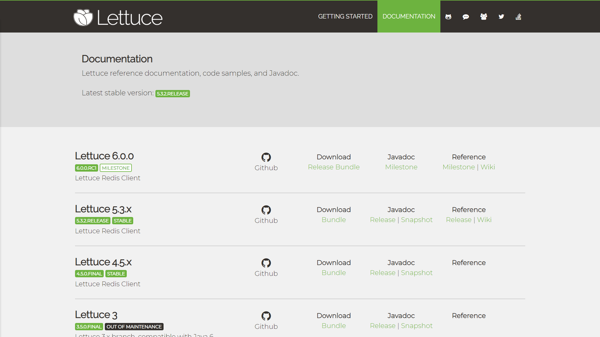

## Lettuce(生菜)学习笔记

#### 简介

> 官网：https://lettuce.io/

```TXT
	Lettuce是一个高性能基于Java编写的Redis驱动框架，底层集成了Project Reactor供天然的反应式编程，通信框架集成了Netty使用了非阻塞IO，5.x版本之后融合了JDK1.8的异步编程特性，在保证高性能的同时提供了十分丰富易用的`API。
	注意一点：Redis的版本至少需要2.6，当然越高越好，API的兼容性比较强大。
```



#### Lettuce和Jedis的比较

```TXT
	Jedis在实现上是直接连接的redis server，如果在多线程环境下是非线程安全的，这个时候只有使用连接池，为每个Jedis实例增加物理连接。Lettuce的连接是基于Netty的，连接实例（StatefulRedisConnection）可以在多个线程间并发访问，因为StatefulRedisConnection是线程安全的，所以一个连接实例（StatefulRedisConnection）就可以满足多线程环境下的并发访问，当然这个也是可伸缩的设计，一个连接实例不够的情况也可以按需增加连接实例。
	Springboot2之前redis的连接池为jedis，2.0以后redis的连接池改为了lettuce，lettuce能够支持redis4，需要java8及以上。lettuce是基于netty实现的与redis进行同步和异步的通信
```

#### Lettuce的使用

> pom.xml文件中导入依赖Jar包

```XML
<!-- https://mvnrepository.com/artifact/io.lettuce/lettuce-core -->
<dependency>
    <groupId>io.lettuce</groupId>
    <artifactId>lettuce-core</artifactId>
    <version>5.3.1.RELEASE</version>
</dependency>
```

